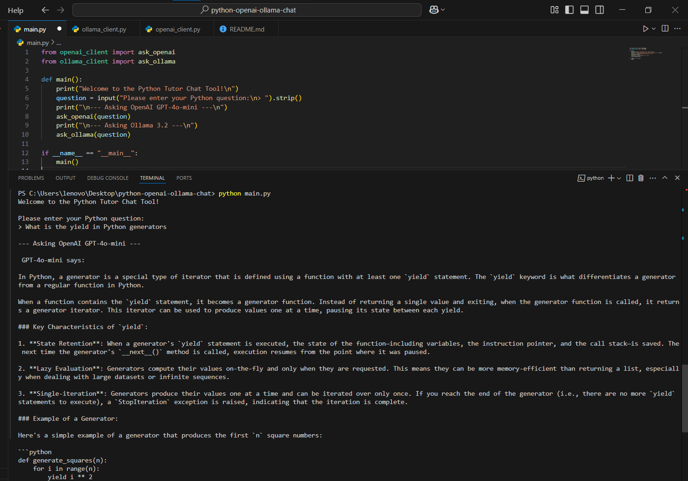

# Python Tutor Chat Tool

This is a simple program that lets you ask questions to two AI models:

- OpenAI GPT-4o-mini (online)  
- LLaMA 3.2 (local on your computer via Ollama)

---

## What You Need

- Python version 3.8 or higher  
- `openai` library (install by running `pip install openai`)  
- `requests` library (install by running `pip install requests`)  
- Ollama server running on your computer at `http://localhost:11434` (only if you want to use LLaMA locally)


---

## How to Run the Program

1. Open the file `openai_client.py` and replace the API key with your own OpenAI API key.  
2. Start the Ollama server on your computer if you want to use LLaMA.  
3. Open the terminal (or command prompt) or Visual Studio Code.  
4. Run this command to start the program:

```bash
python main.py


